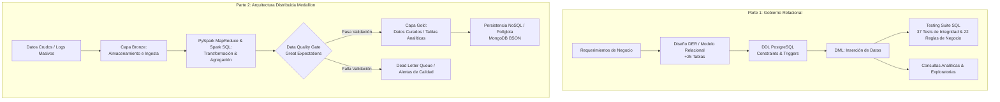

# Enterprise Data Governance & Distributed Big Data Architecture


---

## Executive Summary

Este repositorio contiene el diseño, modelado e implementación integral de una **arquitectura corporativa de Gobierno y Calidad de Datos**, evolucionando desde un **Modelo Relacional normalizado (PostgreSQL)** hacia un **Pipeline Distribuido bajo patrón Medallion (Apache Spark, Great Expectations y MongoDB)**.

El proyecto simula el ciclo completo del dato en una organización:

1. **Gobierno Relacional (OLTP / Data Integrity):** Diseño de un modelo entidad-relación corporativo (25+ entidades), definición de DDL riguroso con restricciones de integridad y una suite de pruebas automatizadas en SQL para auditar 22 Reglas de Acción/Negocio (RA).
2. **Procesamiento Distribuido & Big Data (Medallion Pipeline):** Ingesta, limpieza y transformación masiva de datos mediante **Apache Spark** (Spark SQL y RDDs), incorporación de **Data Quality Gates** con **Great Expectations** y persistencia políglota para almacenamiento semiestructurado en **MongoDB**.

---

## Arquitectura de la Solución



---

## Estructura del Repositorio

```text
├── docs/                                  # DER conceptual/lógico e informes técnicos
│   ├── DER.pdf
│   ├── Informe_Gobierno_Relacional.pdf
│   └── Informe_Arquitectura_Distribuida.pdf
│
├── part-1-relational-governance/          # Capa Relacional (PostgreSQL)
│   └── sql/
│       ├── 00_drop_schema.sql             # Limpieza idempotente de base de datos
│       ├── 01_ddl_schema.sql              # Creación de tablas, claves foráneas y constraints
│       ├── 02_dml_seed_data.sql           # Carga de datos sintéticos de prueba
│       ├── 03_business_rules_testing.sql  # Suite de 37 tests SQL para validación de RA
│       └── 04_exploratory_queries.sql     # Consultas analíticas avanzadas
│
└── part-2-distributed-architecture/       # Capa Distribuida (Big Data & Quality)
    ├── 01_spark_mapreduce.ipynb            # Transformaciones masivas con RDDs / MapReduce
    ├── 02_spark_sql_processing.ipynb       # Procesamiento estructurado con DataFrames
    ├── 03_great_expectations_quality.ipynb # Data Quality Gates y validaciones
    └── 04_mongodb_nosql_integration.ipynb  # Persistencia y agregaciones MongoDB
```

---

## Detalle de Implementación

### Parte 1: Gobierno Relacional y Rigor de Negocio (PostgreSQL)

* **Modelado de Datos:** Construcción de un esquema relacional de más de 25 tablas normalizadas para reflejar operaciones corporativas complejas.
* **Integridad Declarativa:** Implementación de claves primarias compuestas, claves foráneas con políticas de eliminación consistentes y restricciones `CHECK`.
* **Automatización de Reglas de Negocio (22 RAs):** Garantía de políticas de gobernanza a través de una suite propia de **37 scripts de prueba en SQL** que comprueban escenarios de éxito y fallos controlados.
* **Consultas Analíticas:** Scripts de extracción y agregación utilizando funciones de ventana como `ROW_NUMBER()` y `RANK()`, además de CTEs y joins multidimensionales.

### Parte 2: Arquitectura Distribuida y Calidad de Datos (Big Data)

* **Procesamiento Distribuido (Apache Spark):**

  * **MapReduce / RDDs:** Algoritmos de agregación, agrupamiento y mapeo a bajo nivel.
  * **Spark SQL & DataFrames:** Transformaciones analíticas a escala sobre datasets masivos bajo el estándar de arquitectura Medallion:

    **Bronze → Silver → Gold**

* **Data Quality Gates (Great Expectations):**

  * Definición de contratos de datos mediante *Expectation Suites*.
  * Validación de unicidad de IDs, completitud, rangos numéricos válidos y coherencia de esquemas.
  * Prevención de propagación de datos corruptos hacia las capas analíticas.

* **Persistencia NoSQL (MongoDB):**

  * Modelado documental para almacenar entidades semiestructuradas derivadas de la capa analítica.
  * Consultas de agregación para facilitar el consumo desde servicios y aplicaciones downstream.

---

## Stack Tecnológico

| **Dominio**                     | **Herramientas**                           |
| ------------------------------- | ------------------------------------------ |
| **Bases de Datos Relacionales** | PostgreSQL, DDL/DML, Constraints, Triggers |
| **Big Data & Procesamiento**    | Apache Spark, PySpark, Spark SQL, RDDs     |
| **Calidad de Datos & Testing**  | Great Expectations, SQL Assertion Testing  |
| **Bases de Datos NoSQL**        | MongoDB, PyMongo, BSON Aggregations        |
| **Entorno de Trabajo**          | Jupyter Notebooks, Docker, Python 3.x      |

---

## Cómo Ejecutar Este Proyecto

### Requisitos Previos

* PostgreSQL **v14 o superior**
* Python **3.9+**
* Apache Spark / PySpark
* Java compatible con la versión de Spark utilizada
* Jupyter Notebook
* Instancia local o remota de MongoDB
* Docker (opcional, recomendado para facilitar la configuración de servicios)

---

### 1. Ejecutar la Capa Relacional (SQL)

Conéctate a tu base de datos PostgreSQL y ejecuta los scripts en orden secuencial:

```bash
psql -U postgres -d tu_base_datos -f part-1-relational-governance/sql/00_drop_schema.sql

psql -U postgres -d tu_base_datos -f part-1-relational-governance/sql/01_ddl_schema.sql

psql -U postgres -d tu_base_datos -f part-1-relational-governance/sql/02_dml_seed_data.sql

psql -U postgres -d tu_base_datos -f part-1-relational-governance/sql/03_business_rules_testing.sql

psql -U postgres -d tu_base_datos -f part-1-relational-governance/sql/04_exploratory_queries.sql
```

### 2. Ejecutar la Capa Distribuida (PySpark / NoSQL)

Instala las dependencias necesarias:

```bash
pip install pyspark great_expectations pymongo pandas jupyter
```

Luego inicia Jupyter:

```bash
jupyter notebook part-2-distributed-architecture/
```

Ejecuta los notebooks en el siguiente orden:

1. `01_spark_mapreduce.ipynb`
2. `02_spark_sql_processing.ipynb`
3. `03_great_expectations_quality.ipynb`
4. `04_mongodb_nosql_integration.ipynb`

---

## Flujo de Datos

El pipeline distribuido sigue una arquitectura **Medallion**:

```text
                    ┌──────────────────────┐
                    │    Datos Crudos      │
                    │   Logs / Datasets    │
                    └──────────┬───────────┘
                               │
                               ▼
                    ┌──────────────────────┐
                    │       BRONZE         │
                    │ Ingesta y persistencia│
                    └──────────┬───────────┘
                               │
                               ▼
                    ┌──────────────────────┐
                    │       SILVER         │
                    │ Limpieza y             │
                    │ transformación       │
                    └──────────┬───────────┘
                               │
                               ▼
                    ┌──────────────────────┐
                    │   QUALITY GATE       │
                    │ Great Expectations   │
                    └──────────┬───────────┘
                         │           │
                      PASS│           │FAIL
                         ▼           ▼
              ┌───────────────┐  ┌─────────────────┐
              │     GOLD      │  │ Quality Issues  │
              │ Datos Curados │  │ / Rechazados    │
              └───────┬───────┘  └─────────────────┘
                      │
                      ▼
              ┌───────────────┐
              │    MongoDB    │
              │   NoSQL/BSON  │
              └───────────────┘
```

---

## Objetivos del Proyecto

El proyecto busca demostrar la integración de diferentes paradigmas de gestión y procesamiento de datos dentro de una arquitectura empresarial:

* Diseñar modelos relacionales robustos y normalizados.
* Implementar reglas de integridad y negocio directamente en la base de datos.
* Automatizar el testing de reglas de negocio mediante SQL.
* Procesar grandes volúmenes de información utilizando Apache Spark.
* Comparar enfoques de procesamiento mediante RDDs y DataFrames.
* Implementar controles sistemáticos de Data Quality.
* Separar datos crudos, transformados y curados mediante una arquitectura Medallion.
* Integrar almacenamiento relacional y NoSQL dentro de una arquitectura políglota.
* Generar datos preparados para análisis y consumo downstream.

---

## Tecnologías

**PostgreSQL · SQL · Apache Spark · PySpark · Spark SQL · Great Expectations · MongoDB · PyMongo · Python · Jupyter · Docker**

---

## Documentación

La documentación técnica y los informes asociados al proyecto se encuentran disponibles en [`docs/`](./docs/).

Los documentos principales incluyen:

* **DER:** Modelo entidad-relación del sistema.
* **Informe de Gobierno Relacional:** Diseño, restricciones, reglas de negocio y estrategia de testing.
* **Informe de Arquitectura Distribuida:** Diseño del pipeline Big Data, procesamiento distribuido, calidad de datos y persistencia NoSQL.

---

## Nota

Este proyecto fue desarrollado con fines académicos para demostrar conceptos de **Data Governance, Data Quality, Relational Database Design, Big Data Processing y Polyglot Persistence**.

---


